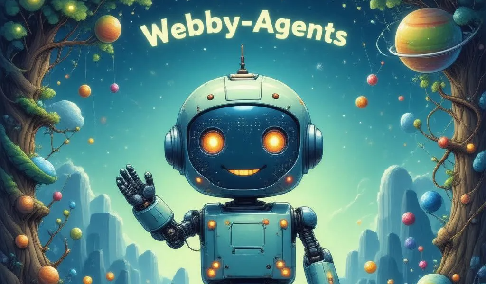

[](https://github.com/gabriel0110/webby-agents/stargazers)
[](https://github.com/gabriel0110/webby-agents/issues)
[](./LICENSE)  

# Webby-Agents Framework

A **simple and extensible** TypeScript/Node.js framework for building AI-powered web-native agents. This framework provides the core building blocks needed to integrate Large Language Models (LLMs) into your web applications and empower them with “agentic” capabilities. The goal is to provide simplicity but also customization and extensibility for more advanced use cases ***if you so desire***.

> **Note**: The framework is **experimental** and still under **active** development and tuning. ***Use at your own risk***. Please report any issues you encounter, and feel free to contribute!

## Key Features

- **OpenAI Integration**  
  Wrappers for OpenAI ChatCompletion and Embeddings (including support for streaming partial tokens).

- **Flexible Memory**  
  - **ShortTermMemory** – stores recent messages for immediate context.  
  - **SummarizingMemory** – automatically summarizes older messages to keep the context manageable (supports optional hierarchical chunk-based summarization).  
  - **LongTermMemory** – an in-memory vector store for semantically relevant retrieval of older context.  
  - **CompositeMemory** – combine multiple memory classes into a single interface (e.g., short-term + summarizing + vector).  

- **Multi-Agent Orchestration**  
  Classes like `AgentTeam` and `AgentRouter` let you run multiple agents in parallel, sequentially, or with routing logic.

- **Pluggable Planning & Workflows**  
  - **Planner** interface for generating structured task plans.  
  - **Workflow** for fixed step-by-step or parallel tasks.

- **Tool Usage**  
  Agents can call custom external “Tools” in a multi-step loop, retrieving data and incorporating it into final answers. You can extend the `Tool` interface for your own use cases.
    - **Parameterized Tools** – tools that take input parameters for more dynamic behavior. See the `tool_parameter_demo.ts` example on how to call tools with required and optional parameters.

- **Safety Controls**  
  Configure max reflection steps, usage limits, time-to-live, plus hooks for user approval on tool calls.

- **Debug Logging & Hooks**  
  Add custom hooks for logging, debugging, or user approval on tool calls. You can enable agent debugging for more detailed logs via the `debug` option, setting it to `true`.

- **Lightweight & Modular**  
  Use only the parts you need, or extend them for advanced use cases (e.g., reflection memory, external vector DBs).

---

## Table of Contents

1. [Installation](#installation)  
2. [Usage & Examples](#usage--examples)  
   - [Basic Agent (Single-Pass)](#1-basic-agent-single-pass)  
   - [Workflow Example (Fixed Steps)](#2-workflow-example-fixed-steps)  
   - [Multi-Tool Agent](#3-multi-tool-agent)  
   - [Agent Team (Parallel/Sequential)](#4-agent-team-parallelsequential)  
   - [RAG Demo (Long-Term Memory Retrieval)](#5-rag-demo-long-term-memory-retrieval)  
   - [Planner Example](#6-planner-example)  
   - [Evaluator Example](#7-evaluator-example)  
   - [Agent with Logging Hooks](#8-agent-with-logging-hooks) 
   - [Agent Task Specification and Output Validation](#9-agent-task-specification-and-output-validation) 
3. [Agent Options & Settings](#agent-options--settings)  
4. [Memory](#memory)  
5. [Models](#models)  
6. [Multi-Agent Orchestration](#multi-agent-orchestration)  
7. [Planner & Workflow](#planner--workflow)  
8. [Evaluators](#evaluators)  
9. [Advanced Patterns and Best Practices](#advanced-patterns-and-best-practices)  
   - [Reflection Memory](#reflection-memory)  
   - [Safe Run Methods](#safe-run-methods)  
   - [Advanced Multi-Agent Synergy](#advanced-multi-agent-synergy)
10. [Building & Running](#building--running)  
11. [FAQ](#faq)  
12. [Roadmap](#roadmap)  
13. [License](#license)

---

## Installation

```bash
# Using npm:
npm install webby-agents

# Or using yarn:
yarn add webby-agents
```

> You need a recent version of Node (>= 18) and TypeScript (>= 4.9).

---

## Usage & Examples

Below are demos demonstrating different ways to build and orchestrate agents.

### 1) **Basic Agent (Single-Pass)**

**Goal**: A minimal agent that performs a single LLM call. No reflection, no tools, just a direct “Question -> Answer.”

```ts
import { Agent } from "webby-agents";
import { OpenAIChat } from "webby-agents";
import { ShortTermMemory } from "webby-agents";

async function main() {
  // 1) Create a minimal LLM
  const chatModel = new OpenAIChat({
    apiKey: "YOUR-API-KEY",
    model: "gpt-4o-mini",
    temperature: 0.7,
    stream: true, // Stream output to console
    onToken: (token) => process.stdout.write(token), // Hook to process tokens (basic example)
  });

  // 2) Create a simple short-term memory
  const shortTermMemory = new ShortTermMemory(5);

  // 3) Instantiate an Agent with NO reflection or tools
  const agent = Agent.create({
    model: chatModel,
    memory: shortTermMemory,
    instructions: [
      "You are a simple agent. Answer only in one short sentence."
    ],
    options: {
      useReflection: false,  // Single pass only
      maxSteps: 1,
      usageLimit: 2,
      timeToLive: 5000,
    },
  });

  // 4) Run the agent with a simple question
  const userQuestion = "What's a quick tip for staying productive at work?";
  console.log("User Question:", userQuestion);

  const answer = await agent.run(userQuestion);
  console.log("\n\nAgent's Final Answer:", answer);
}

main().catch(console.error);
```

**Key Observations**:
- Agent is **single-pass** by setting `useReflection: false`.  
- Only **ShortTermMemory** is appended automatically, storing the last few messages.  
- Good for trivial or low-cost tasks with no tool usage.

---

### 2) **Workflow Example (Fixed Steps)**

**Goal**: Demonstrate a fixed-step approach using the `Workflow` class, which is simpler than an agent for known tasks.

```ts
import { Workflow, LLMCallStep } from "webby-agents";
import { OpenAIChat } from "webby-agents";
import { ShortTermMemory } from "webby-agents";

async function main() {
  // Create a model
  const model = new OpenAIChat({
    apiKey: "YOUR_API_KEY",
    model: "gpt-4o-mini",
    temperature: 0.7,
  });

  const memory = new ShortTermMemory(10);

  // Define steps
  const step1 = new LLMCallStep(model, "Step 1: Greet the user politely.");
  const step2 = new LLMCallStep(model, "Step 2: Provide a brief motivational quote.");

  const workflow = new Workflow([step1, step2], memory);

  const userInput = "I need some positivity today!";
  console.log("User says:", userInput);

  const finalOutput = await workflow.runSequential(userInput);
  console.log("Workflow Final Output:", finalOutput);
}

main().catch(console.error);
```

**Key Observations**:
- Each `LLMCallStep` has its own “system prompt.”  
- The user input is added to memory, each step sees the updated context.  
- Great for “scripted” or “predefined” pipelines.

---

### 3) **Multi-Tool Agent**

**Goal**: Show how an agent can have multiple tools (fake or real) and call them autonomously.

```ts
import { Agent, ShortTermMemory, OpenAIChat, Tool } from "webby-agents";

// Dummy tool #1
class FakeSearchTool implements Tool {
  name = "FakeSearch";
  description = "Simulates a search engine lookup (dummy).";
  async run(input: string): Promise<string> {
    return `FAKE SEARCH RESULTS for "${input}"`;
  }
}

// Dummy tool #2
class FakeTranslatorTool implements Tool {
  name = "FakeTranslator";
  description = "Pretends to translate input text into French.";
  async run(input: string): Promise<string> {
    return `FAKE TRANSLATION to French: "${input}" => [Ceci est une traduction factice]`;
  }
}

async function main() {
  const chatModel = new OpenAIChat({
    apiKey: "YOUR_API_KEY",
    model: "gpt-4o-mini"
  });

  const mem = new ShortTermMemory(10);

  const agent = Agent.create({
    name: "MultiToolAgent",
    model: chatModel,
    memory: mem,
    tools: [new FakeSearchTool(), new FakeTranslatorTool()],
    instructions: [
      "Use FakeSearch if the user requests data from the web.",
      "Use FakeTranslator if the user wants it in French."
    ],
    options: {
      useReflection: true,
      maxSteps: 5,
      usageLimit: 5,
    }
  });

  const userQuestion = "Search for today's top news and then translate the summary into French.";
  console.log("User Question:", userQuestion);

  const answer = await agent.run(userQuestion);
  console.log("Final Answer:", answer);
}

main().catch(console.error);
```

**Key Observations**:
- Multiple tools allow more complex tasks.  
- The agent can choose to use one or both tools in its reflection loop.  
- Tools are minimal “run(input: string) => string” classes.

---

### 4) **Agent Team (Parallel/Sequential)**

**Goal**: Show how multiple agents can coordinate using `AgentTeam`.

```ts
import { Agent, AgentTeam, ShortTermMemory, OpenAIChat } from "webby-agents";

async function main() {
  // Agent #1: "GreetingAgent"
  const greetingAgent = Agent.create({
    name: "GreetingAgent",
    model: new OpenAIChat({ apiKey: "KEY", model: "gpt-4o-mini" }),
    memory: new ShortTermMemory(5),
    instructions: ["Greet the user in a friendly way."],
    options: { useReflection: false, maxSteps: 1 }
  });

  // Agent #2: "MotivationAgent"
  const motivationAgent = Agent.create({
    name: "MotivationAgent",
    model: new OpenAIChat({ apiKey: "KEY", model: "gpt-4o-mini" }),
    memory: new ShortTermMemory(5),
    instructions: ["Provide a short motivational statement."],
    options: { useReflection: false, maxSteps: 1 }
  });

  // Create a team
  const team = new AgentTeam("Greeting+MotivationTeam", [greetingAgent, motivationAgent]);

  const userPrompt = "I could use some positivity today!";
  console.log("User Prompt:", userPrompt);

  // Run them in parallel
  const parallelResults = await team.runInParallel(userPrompt);
  console.log("Parallel Results:", parallelResults);

  // Run them sequentially
  const sequentialResult = await team.runSequential(userPrompt);
  console.log("Sequential Result:", sequentialResult);
}

main().catch(console.error);
```

**Key Observations**:
- `runInParallel` returns an array of answers.  
- `runSequential` passes the previous agent’s output as the next agent’s input.  
- Each agent can have its own memory, instructions, or tools.

---

### 5) **RAG Demo (Long-Term Memory Retrieval)**

**Goal**: Show how to store older context in a semantic vector store and retrieve it later.

```ts
import { Agent, CompositeMemory, ShortTermMemory, SummarizingMemory, LongTermMemory, OpenAIChat, OpenAIEmbeddings } from "webby-agents";

async function main() {
  // Models
  const chatModel = new OpenAIChat({ apiKey: "KEY", model: "gpt-4o-mini" });
  const summarizerModel = new OpenAIChat({ apiKey: "KEY", model: "gpt-4o-mini" });
  const embeddingsModel = new OpenAIEmbeddings({ apiKey: "KEY", model: "text-embedding-3-small" });

  // Memories
  const shortMem = new ShortTermMemory(5);
  const sumMem = new SummarizingMemory({ threshold: 5, summarizerModel });
  const longMem = new LongTermMemory({ embeddings: embeddingsModel, topK: 3 });

  // Combine them
  const compositeMem = new CompositeMemory(shortMem, sumMem, longMem);

  const agent = Agent.create({
    name: "RAGAgent",
    model: chatModel,
    memory: compositeMem,
    instructions: ["Recall older context when asked about it."],
    options: { useReflection: true, maxSteps: 5 }
  });

  // Store some data
  await agent.run("I'm planning a road trip from LA to Vegas on June 15. Budget: $500 total.");
  await agent.run("Add note: also want to do a hot air balloon ride if possible.");

  // Later
  const question = "Remind me what my plan was, and how much budget I allocated?";
  const answer = await agent.run(question);
  console.log("Agent’s Final Answer:", answer);
}

main().catch(console.error);
```

**Key Observations**:
- ShortTermMemory captures immediate recency, SummarizingMemory condenses older conversation, LongTermMemory performs semantic retrieval.  
- CompositeMemory merges them all, so the agent has a holistic memory.  
- By default, the agent tries to append everything, but can be adapted for more advanced usage.

---

### 6) **Planner Example**

**Goal**: Show how a `Planner` can generate a structured plan (JSON or bullet list) that the agent may follow before final reasoning.

```ts
import { Agent, SimpleLLMPlanner, OpenAIChat, ShortTermMemory, Tool } from "webby-agents";

// Dummy tool
class DummyCalendarTool implements Tool {
  name = "Calendar";
  description = "Manages scheduling or date lookups (dummy).";
  async run(input: string): Promise<string> {
    return `FAKE CALENDAR ACTION for "${input}"`;
  }
}

async function main() {
  const mainModel = new OpenAIChat({ apiKey: "KEY", model: "gpt-4o-mini" });
  const plannerModel = new OpenAIChat({ apiKey: "KEY", model: "gpt-4o-mini" });

  const planner = new SimpleLLMPlanner(plannerModel);
  const memory = new ShortTermMemory(5);
  const calendarTool = new DummyCalendarTool();

  const agent = Agent.create({
    name: "PlannerAgent",
    model: mainModel,
    memory,
    tools: [calendarTool],
    planner,
    instructions: ["If the plan step references Calendar, call it."],
    options: { maxSteps: 5, usageLimit: 10, timeToLive: 30000, useReflection: true, debug: true },
    hooks: {
      onPlanGenerated: (plan) => console.log("[Plan Generated]", plan),
    },
  });

  const userQuery = "Schedule a meeting next Friday to discuss project updates.";
  console.log("User Query:", userQuery);

  const answer = await agent.run(userQuery);
  console.log("Final Answer:", answer);
}

main().catch(console.error);
```

**Key Observations**:
- `SimpleLLMPlanner` can produce a plan describing steps or tools to call.  
- The agent can parse or interpret that plan in a multi-step loop.  
- `onPlanGenerated` hook logs the plan for debugging.

---

### 7) **Evaluator Example**

**Goal**: Show how an additional LLM call can critique or score the agent’s final output using `SimpleEvaluator`.

```ts
import { Agent, SimpleEvaluator, ShortTermMemory, OpenAIChat } from "webby-agents";

async function main() {
  const agentModel = new OpenAIChat({ apiKey: "KEY", model: "gpt-4o-mini" });
  const memory = new ShortTermMemory(10);

  const agent = Agent.create({
    name: "EvaluatedAgent",
    model: agentModel,
    memory,
    instructions: ["Provide a concise explanation."],
    options: { maxSteps: 3, usageLimit: 5, useReflection: true },
  });

  // The evaluator uses a second (or same) LLM to critique
  const evalModel = new OpenAIChat({ apiKey: "KEY", model: "gpt-4o-mini" });
  const evaluator = new SimpleEvaluator(evalModel);

  const question = "Explain the difference between supervised and unsupervised learning.";
  const answer = await agent.run(question);

  console.log("Agent's Final Answer:", answer);

  // Evaluate final answer
  const conversation = await memory.getContext();
  const result = await evaluator.evaluate(conversation);

  console.log("Evaluation Score:", result.score);
  console.log("Feedback:", result.feedback);
  console.log("Improvements:", result.improvements);
}

main().catch(console.error);
```

**Key Observations**:
- A separate LLM pass can generate a `score` and `feedback`.  
- In production, you might automate a re-try loop if score < threshold.  
- Evaluation is an optional feature to refine or grade agent outputs.

---

### 8) **Agent with Logging Hooks**

**Goal**: Demonstrate using `hooks` (`onStep`, `onToolCall`, `onFinalAnswer`) for debugging and user approvals.

```ts
import { Agent, ShortTermMemory, OpenAIChat, Tool } from "webby-agents";

class DummyMathTool implements Tool {
  name = "DummyMath";
  description = "Performs fake math calculations (always returns 42).";
  async run(input: string): Promise<string> {
    return `The result of "${input}" is 42.`;
  }
}

async function main() {
  const model = new OpenAIChat({
    apiKey: "YOUR_KEY",
    model: "gpt-4o-mini",
    temperature: 0.6,
  });

  const memory = new ShortTermMemory(5);

  const hooks = {
    onStep: (messages: any) => {
      console.log("[Hook: onStep] Current messages:", messages);
    },
    onToolCall: async (toolName: string, query: string) => {
      console.log(`[Hook: onToolCall] Tool="${toolName}" Query="${query}"`);
      return true; // could return false to cancel
    },
    onFinalAnswer: (answer: string) => {
      console.log("[Hook: onFinalAnswer] =>", answer);
    }
  };

  const agent = Agent.create({
    name: "HookedAgent",
    model,
    memory,
    tools: [new DummyMathTool()],
    instructions: ["If user asks for a calculation, call DummyMath."],
    hooks,
    options: { useReflection: true, maxSteps: 5, usageLimit: 5, debug: true },
  });

  const question = "What is 123 + 456, approximately?";
  console.log("User asks:", question);

  const answer = await agent.run(question);
  console.log("Final Answer from Agent:", answer);
}

main().catch(console.error);
```

**Key Observations**:
- `onToolCall` can be used to require user confirmation or log usage.  
- `onStep` shows the conversation state after each reflection step.  
- `debug: true` provides more console logs for diagnosing agent flow.

---

### 9) **Agent Task Specification and Output Validation**

**Goal**: Demonstrate how to specify a task for the agent and have the output validated by a validation model.

```ts
import { Agent, AgentOptions, ShortTermMemory, OpenAIChat } from "webby-agents";

async function runValidatedAgent() {
  // Optionally use different models or the same model for both the agent and validation
  const mainModel = new OpenAIChat({ apiKey: "YOUR-API-KEY", model: "gpt-4o-mini" });
  const validatorModel = new OpenAIChat({ apiKey: "YOUR-API-KEY", model: "gpt-4o-mini" });

  const memory = new ShortTermMemory(20);

  const agentOptions: AgentOptions = {
    validateOutput: true, // We want to validate agent responses
    debug: true
  };

  const agent = Agent.create({
    name: "ValidatorAgent",
    model: mainModel,
    validationModel: validatorModel,   // <--- Provide the validator
    memory,
    instructions: ["You are an agent that does simple math."],
    task: "User wants the sum of two numbers",  // <--- Short example task specification
    options: agentOptions,
  });

  const userQuery = "Add 2 and 2 for me, thanks!";
  const finalAns = await agent.run(userQuery);
  console.log("Final Answer from Agent:", finalAns);
}

main().catch(console.error);
```

**Key Observations**:
- `validateOutput: true` tells the agent to validate its output.
- The `task` field is a short description of the task the agent is expected to perform.
- The `validationModel` is used to validate the agent's output.

---

## Agent Options & Settings

**`AgentOptions`** let you shape agent behavior:

| Option         | Default   | Description                                                                     |
|----------------|-----------|---------------------------------------------------------------------------------|
| **`maxSteps`** | `15`       | Max reflection steps in the reasoning loop (`-1` = unlimited).                 |
| **`usageLimit`** | `15`     | Maximum total LLM calls (cost control) (`-1` = unlimited)                      |
| **`useReflection`** | `true` | If `false`, a single pass only. Tools require reflection to see their results.|
| **`timeToLive`** | `60000` | (ms) Halts the agent if it runs too long. (`-1` = unlimited).                   |
| **`debug`** | `false`     | More logs about each step and the final plan.                                    |
| **`validateOutput`** | `false` | If `true`, the agent validates its output with a second LLM.                |

---

## Memory

### Memory Philosophy

- **ShortTermMemory** is best for immediate context (most recent messages).  
- **SummarizingMemory** prevents bloat by condensing older conversation; optionally can store multiple chunk-level summaries if `hierarchical` is set.  
- **LongTermMemory** uses semantic embeddings for retrieving older messages by similarity (mini RAG).  
- **CompositeMemory** merges multiple memory strategies into one.  

### ReflectionMemory (Optional)

You can create a specialized memory just for the agent’s chain-of-thought or self-critique (“reflection”) that is never shown to the user. This can be helpful for debugging or advanced self-correction patterns.

---

## Models

### `OpenAIChat`

- **`model`**: e.g., `"gpt-4o-mini"` 
- **`temperature`**: Controls creativity.  
- **`stream`** + **`onToken`**: For partial token streaming.  

### `OpenAIEmbeddings`

- **`model`**: e.g., `"text-embedding-3-small"`.  
- Used for semantic similarity in `LongTermMemory`.

---

## Multi-Agent Orchestration

### `AgentTeam`

Runs multiple Agents in **parallel** (`runInParallel`) or **sequential** (`runSequential`). Good for combining domain-specific agents (e.g. finance + web search + summarizer).

### `AgentRouter`

Uses a custom routing function to pick which agent handles a query.

### `AdvancedAgentTeam`

A more advanced version of `AgentTeam` that allows for more complex routing logic, hooks, and interleaved round-robin-style execution.

### `AdvancedAgentRouter`

A more advanced version of `AgentRouter` that allows for more complex routing logic, including LLM-based routing, agent capability specifications, and more.

### `LLMConvergenceChecker`

A custom convergence check for multi-agent orchestration that uses an LLM to decide if convergence has been reached. This can be useful for more complex multi-agent orchestration scenarios.

---

## Planner & Workflow

- **`Planner`** interface + **`SimpleLLMPlanner`** let you do a “plan-then-execute” approach, where the LLM can propose a structured plan (for example in JSON) and the system executes each step. This is typically for more open-ended tasks where you want some autonomy, but still want to parse or validate a plan.

- **`Workflow`** provides a **simpler**, more **prescriptive** pattern for tasks that follow a **known sequence** of steps. Instead of letting the LLM dynamically decide how to solve the problem (like an Agent would), the developer defines a series of steps in code. Each step receives the current conversation context (from memory) and returns a new message. The `Workflow` then appends that message to memory and continues to the next step.

### Workflows in Detail

A **Workflow** is composed of multiple **workflow steps**. Each step implements the interface:

```ts
interface WorkflowStep {
  name?: string;
  // Receives an array of conversation messages, returns exactly one new message
  run(messages: ConversationMessage[]): Promise<ConversationMessage>;
}
```

The **`Workflow`** class orchestrates how these steps are invoked:

1. **`runSequential`**:
   - Calls each step **in order**, passing in the updated conversation context (from memory).
   - Each step returns a new message, which is appended to memory.
   - The final output is the `content` of the last step’s message.

2. **`runParallel`**:
   - Runs **all steps at once** on the same conversation context, gathering all results and appending them to memory.
   - Returns an array of the messages `content` values.

3. **`runConditional`**:
   - Similar to `runSequential`, but you provide a `conditionFn` that checks the last step’s output. If the condition fails, it stops immediately.

### Example: A Simple Workflow

```ts
import { Workflow, LLMCallStep } from "webby-agents/Workflow";
import { OpenAIChat } from "webby-agents/LLMs";
import { ShortTermMemory } from "webby-agents/memory";

async function main() {
  // Create a model
  const model = new OpenAIChat({
    apiKey: "YOUR_API_KEY",
    model: "gpt-4o-mini",
    temperature: 0.7,
  });

  // Use a short-term memory for storing conversation
  const memory = new ShortTermMemory(10);

  // Define steps
  const step1 = new LLMCallStep(model, "Step 1: Greet the user politely.");
  const step2 = new LLMCallStep(model, "Step 2: Provide a brief motivational quote.");

  // Create and run workflow
  const workflow = new Workflow([step1, step2], memory);

  const userInput = "I need some positivity today!";
  console.log("User says:", userInput);

  const finalOutput = await workflow.runSequential(userInput);
  console.log("Workflow Final Output:", finalOutput);
}

main().catch(console.error);
```

1. **Step 1** sees the user message, plus any prior context in memory, and calls OpenAI with a system prompt of `"Step 1: Greet the user politely."`.
2. The result is appended to memory, and then **Step 2** sees that updated conversation and calls OpenAI with `"Step 2: Provide a brief motivational quote."`.
3. Finally, you get a single `Workflow Final Output`.

### When to Use a Workflow vs. an Agent?

- **Workflow**:  
  - You have a **predefined** or **fixed** series of steps you want to run each time (e.g., “collect user input, summarize, translate, finalize”).
  - You need **predictability** or a **scripted** approach.  
  - Each step is a known function or LLM call; the model does not “choose” how to proceed.

- **Agent**:  
  - The LLM is **autonomous** and decides which tool(s) to call, in which order, and when to produce a final answer.
  - You want **dynamic** multi-step reasoning or “tool usage” in a ReAct-like loop.
  - The agent uses reflection, tool requests, memory, and potentially self-correction or planning.

### Combining an Agent with a Workflow

You can place an **Agent** call inside a **WorkflowStep** if you want a hybrid approach:

```ts
class AgentCallStep implements WorkflowStep {
  private agent: Agent;
  constructor(agent: Agent) {
    this.agent = agent;
  }
  async run(messages: ConversationMessage[]): Promise<ConversationMessage> {
    // Possibly parse 'messages' to get user input or context
    const userInput = messages.find((m) => m.role === "user")?.content ?? "";
    const agentAnswer = await this.agent.run(userInput);
    return { role: "assistant", content: agentAnswer };
  }
}
```

Then, include `AgentCallStep` in your workflow steps array if you want “one step” to let the LLM operate in a more autonomous, tool-using manner, but still in a bigger scripted flow.

**In short**, **Workflows** are a simpler, **prescriptive** approach to orchestrating multiple LLM calls or transformations, while **Agents** handle open-ended tasks where the LLM can reason about which steps (Tools) to use to get to the final answer.


---

## Evaluators

- **`SimpleEvaluator`** uses a second LLM to critique or rate the final output.  
- Could be extended for “chain-of-thought” improvement loops, auto-correction, or advanced QA.

---

## Advanced Patterns and Best Practices

Beyond the standard usage patterns (single-pass Agents, Workflows, multi-tool or multi-agent orchestration), **webby-agents** supports more advanced scenarios that can significantly expand agent capabilities. Below are additional patterns and tips for **self-reflection**, **multi-agent synergy**, **error-safe runs**, and more.

### Reflection Memory

**What is it?**  
A specialized `ReflectionMemory` allows the agent to store an internal “chain-of-thought” or self-critique messages (role: `"reflection"`) that aren’t shown to the user. This can be useful for:
- **Self-correction**: The agent can note mistakes, then fix them in subsequent steps (if `includeReflections` is `true`).
- **Debugging**: Developers can review the chain-of-thought to see where the agent might have gone wrong without exposing it to end users.
- **Audit / Logging**: Keep an internal record of the agent’s reasoning steps for advanced QA.

**Example**  
```ts
import { Agent } from "webby-agents/agents";
import { ShortTermMemory, CompositeMemory, ReflectionMemory } from "webby-agents/memory";
import { OpenAIChat } from "webby-agents/LLMs";

async function main() {
  const chatModel = new OpenAIChat({ apiKey: "YOUR_API_KEY", model: "gpt-4o-mini" });

  // Public conversation memory
  const publicMem = new ShortTermMemory(5);

  // Reflection memory (not shown to user)
  const reflectionMem = new ReflectionMemory(false); // false => do NOT append reflection to prompt

  // Combine them so the agent has a single memory object
  const composite = new CompositeMemory(publicMem, reflectionMem);

  const agent = Agent.create({
    name: "ReflectiveAgent",
    model: chatModel,
    memory: composite,
    instructions: [
      "You are a reflective agent; keep your chain-of-thought hidden from the user."
    ]
  });

  // Add logic to store reflection after final answer or each step
  const originalHooks = agent["hooks"] || {};
  agent["hooks"] = {
    ...originalHooks,
    onFinalAnswer: (answer: string) => {
      // Save a reflection message
      reflectionMem.addMessage({
        role: "reflection",
        content: `I produced answer="${answer}". Next time, double-check for accuracy.`
      });
    }
  };

  const userQuestion = "How tall is Mount Everest in meters?";
  const finalAnswer = await agent.run(userQuestion);
  console.log("Agent's Final Answer =>", finalAnswer);

  // Inspect reflection memory for debugging
  const reflections = await reflectionMem.getContext();
  console.log("ReflectionMemory =>", reflections);
}

main().catch(console.error);
```

> **Chain-of-Thought Disclaimer**: If you choose to feed the reflection messages back into the prompt (`includeReflections=true`), be aware of token usage and the potential to leak chain-of-thought if not handled carefully in final user outputs.

---

### Safe Run Methods

When orchestrating multiple agents, you may want more robust error handling. For example:

- **Stop On Error**: Immediately stop if any agent fails.  
- **Continue On Error**: Log the error but proceed with subsequent agents.

**Example**  
```ts
import { AgentTeam } from "webby-agents/agents/multi-agent/AgentTeam";
import { Agent } from "webby-agents/agents";
import { ShortTermMemory } from "webby-agents/memory/ShortTermMemory";
import { OpenAIChat } from "webby-agents/LLMs";

// Extend AgentTeam for the sake of having a custom class
class SafeAgentTeam extends AgentTeam {
    // You can change the constructor or add more methods if you want
}

async function main() {
  // 1) Create LLM(s)
  const model1 = new OpenAIChat({
    apiKey: "YOUR-API-KEY",
    model: "gpt-4o-mini",
    temperature: 0.7,
  });
  const model2 = new OpenAIChat({
    apiKey: "YOUR-API-KEY",
    model: "gpt-4o-mini",
    temperature: 0.7,
  });
  const model3 = new OpenAIChat({
    apiKey: "YOUR-API-KEY",
    model: "gpt-4o-mini",
    temperature: 0.7,
  });

  // 2) Create memory for each agent
  const memA = new ShortTermMemory(5);
  const memB = new ShortTermMemory(5);
  const memC = new ShortTermMemory(5);

  // 3) Create agents
  const agentA = Agent.create({
    name: "AgentA",
    model: model1,
    memory: memA,
    instructions: ["Respond politely. (No error here)"],
    options: { maxSteps: 1, useReflection: false }
  });

  // AgentB intentionally might throw an error or produce unexpected output
  const agentB = Agent.create({
    name: "AgentB",
    model: model2,
    memory: memB,
    instructions: ["Pretend to attempt the user query but throw an error for demonstration."],
    options: { maxSteps: 1, useReflection: false }
  });

  // Force an error for agentB to demonstrate safe run
  agentB.run = async (input: string) => {
    throw new Error("Intentional error from AgentB for demonstration!");
  };

  const agentC = Agent.create({
    name: "AgentC",
    model: model3,
    memory: memC,
    instructions: ["Provide a short helpful answer. (No error)"],
    options: { maxSteps: 1, useReflection: false }
  });

  // 4) Create our SafeAgentTeam (again, extends AgentTeam - see AgentTeam.ts)
  const team = new SafeAgentTeam("DemoTeam", [agentA, agentB, agentC]);

  // 5) Define some hooks to see what happens behind the scenes
  const hooks: TeamHooks = {
    onAgentStart: (agentName, input) => {
      console.log(`[START] ${agentName} with input: "${input}"`);
    },
    onAgentEnd: (agentName, output) => {
      console.log(`[END] ${agentName}: output => "${output}"`);
    },
    onError: (agentName, error) => {
      console.error(`[ERROR] in ${agentName}: ${error.message}`);
    },
    onFinal: (outputs) => {
      console.log("Final outputs from the entire sequential run =>", outputs);
    },
  };

  // 6a) Demonstrate runSequentialSafe with stopOnError=true
  //         - With stopOnError=true, the loop breaks immediately after AgentB throws an error,
  //           so AgentC never runs.
  console.log("\n--- runSequentialSafe (stopOnError = true) ---");
  const userPrompt = "Hello from the user!";
  const resultsStopOnError = await team.runSequentialSafe(userPrompt, true, hooks);
  console.log("\nResults (stopOnError=true):", resultsStopOnError);

  // 6b) Demonstrate runSequentialSafe with stopOnError=false
  //         - With stopOnError=false, AgentB's error is logged, but AgentC still gets a chance to run,
  //           producing its output as the final step.
  console.log("\n--- runSequentialSafe (stopOnError = false) ---");
  const userPrompt2 = "Another user query - let's see if we continue after errors.";
  const resultsContinue = await team.runSequentialSafe(userPrompt2, false, hooks);
  console.log("\nResults (stopOnError=false):", resultsContinue);
}

main().catch(console.error);
```

---

### Advanced Multi-Agent Synergy

Your **AgentTeam** and **AgentRouter** can be extended for more collaborative or specialized interactions:

1. **Shared Memory**: Give each agent the **same** memory instance so they see the entire conversation as it evolves.
2. **Interleaved/Chat-Like**: Round-robin the agents in a while loop until a convergence condition (like `"FINAL ANSWER"`) is met.
3. **Sub-Teams**: Combine `AgentRouter` (for domain routing) with an `AgentTeam` (for parallel or sequential synergy among a subset).

**Example**: Interleaved approach with a shared memory
```ts
import { AdvancedAgentTeam } from "webby-agents/agents/multi-agent/AdvancedAgentTeam";

async function main() {
  // Build 2 specialized agents
  // Enable shared memory so they see each other's messages
  const advancedTeam = new AdvancedAgentTeam("RoundRobinTeam", [agent1, agent2], sharedMem);
  advancedTeam.enableSharedMemory();

  // They "talk" to each other until "FINAL ANSWER" or max 10 rounds
  function checkConverged(msg: string) {
    return msg.includes("FINAL ANSWER");
  }

  const final = await advancedTeam.runInterleaved("Collaborate on a solution, finalize with 'FINAL ANSWER:'", 10, checkConverged);
  console.log("Final synergy output =>", final);
}

main().catch(console.error);
```

---

### Aggregator & Consensus

You might want a final “aggregator” agent that merges the outputs of multiple sub-agents into a single consensus answer.

```ts
class AggregatorAgentTeam extends AgentTeam {
  private aggregator: Agent;

  constructor(name: string, agents: Agent[], aggregator: Agent) {
    super(name, agents);
    this.aggregator = aggregator;
  }

  // For instance, gather parallel results, pass them to aggregator
  public async runWithAggregator(query: string): Promise<string> {
    const results = await this.runInParallel(query);
    const combined = results.join("\\n---\\n");
    return this.aggregator.run(`Sub-agent answers:\n${combined}\nPlease unify them:`);
  }
}
```

---

## Additional Recommendations & Thoughts

- **Agent Performance & Prompting**: Agentic systems are all about the prompts. They will only work as well as the prompts you provide. Ensure they are clear, concise, and tailored to the task at hand for every use case. There are many guides on prompting LLMs effectively, and I would advise reading them.
- **Security / Tools**: If you use “write actions” or potentially destructive tools, ensure you have human approval hooks or environment isolation (sandboxing).  
- **Chain-of-thought Safety**: If reflection memory is fed back into the final prompt or user response, carefully ensure it does not leak internal reasoning to the user if that is not desired.  
- **External Vector DB**: For production scale retrieval, integrate with an actual vector database instead of in-memory stores.  
- **Local LLM**: For on-prem or offline scenarios, adapt the code to use local inference with something like Transformers.js or custom endpoints.  

---

## Building & Running

1. **Install** dependencies:
```bash
npm install
```

2. **Build**:
```bash
npm run build
```

3. **Run** a specific demo:
```bash
npx ts-node src/examples/basic_agent.ts
```

---

## FAQ

1. **Why multi-step reflection?**  
   Because tool usage, memory retrieval, or planning steps require the agent to see the result of each action before finalizing an answer.

2. **Can I swap SummarizingMemory for another approach?**  
   Absolutely. Any class implementing `Memory` works. You can also create a chunk-based or hierarchical summarizing approach.

3. **Is everything stored in memory ephemeral?**  
   By default, yes. For a persistent store, integrate an external vector DB or a database for your conversation logs.

4. **How do I see partial streaming tokens?**  
   Set `stream = true` in `OpenAIChat`, and provide an `onToken` callback to process partial output in real time.  

5. **Do I need to use an agent framework?**
   Absolutely not. Frameworks are just tools to assist in building more complex agents. You can use the LLMs directly with loops if you prefer.

6. **Do I have to use everything in the library?**  
   Nope. You can pick and choose the components you need. The library is designed to be modular and flexible. You can use the most basic agent implementation for basic agentic tasks, or you can use the more advanced features for more complex scenarios. You can even extend the library with your own custom components and features. The goal is to provide you with the ***options*** to build the agent you need for your desired use case. A lot of the advanced features are there to help you build more robust, more capable agents, but you don't have to use them if you don't need them.

---

## Roadmap

- **External Vector DB Integrations** (FAISS, Pinecone, Weaviate, etc.)  
- **Local LLMs** via Transformers.js and WebGPU-based inference if available  
- **More LLM API integrations** (e.g., Together.ai, Anthropic, Google, etc.)  
- **More External Tools**  (e.g., Firecrawl, SerpAPI, etc.)  
- **Browser Vision Tools** (image recognition, OCR, etc.)  
- **Multi-step self-correction** (auto re-try if evaluator score < threshold)  
- **Improved Observability** (agent API metrics, logging, and tracing - dedicated files and possibly a dashboard)

---

## License

This project is licensed under the **MIT License**. See the [LICENSE](./LICENSE) file for details.

Feel free to submit PRs or open issues for new tools, memory ideas, or advanced agent patterns.
