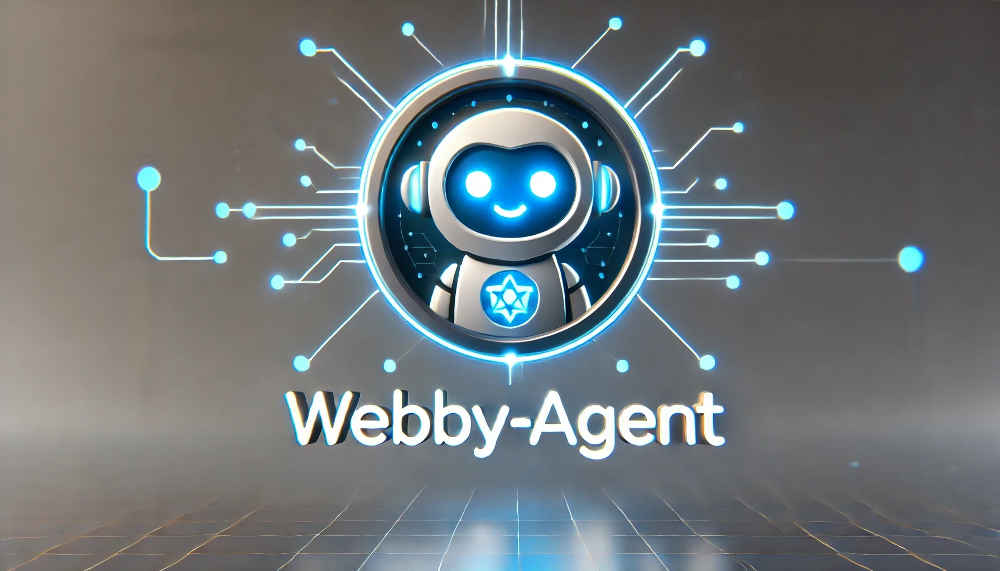

# Webby-Agent Framework

A **super simple yet extensible** TypeScript/Node.js framework for building AI-powered agents with memory, tool usage (e.g. web search), and multi-step reasoning. This project provides the core building blocks needed to integrate Large Language Models (LLMs) into your web or Node.js applications and empower them with “agentic” capabilities.

***[!!] **Under Development**: This project is still under **early** development and may have some rough edges and bugs. Please report any issues you encounter, and feel free to contribute to the project!***

## Key Features

- **OpenAI Integration**: Includes wrappers for OpenAI ChatCompletion and Embeddings.  
- **Flexible Memory**: 
  - **ShortTermMemory** stores recent messages for context.
  - **SummarizingMemory** automatically summarizes older messages to keep the context manageable.  
  - **LongTermMemory** (with an in-memory vector store) to recall older context by semantic similarity.  
- **Tool Usage**: Agents can call external “Tools” (e.g., DuckDuckGo web search) in a multi-step loop, retrieving real-time data and incorporating it into their final answers.  
- **Safety Controls**: Configure maximum reflection steps, usage limits (for LLM calls), and time-to-live (in milliseconds) to avoid runaway costs and infinite loops. 
- **Lightweight & Modular**: Use only the parts you need, or extend them for your own advanced use cases.

## Table of Contents

1. [Installation](#installation)  
2. [Project Structure](#project-structure)  
3. [Usage & Examples](#usage--examples)  
   - [1. Basic Single Agent](#1-basic-single-agent)  
   - [2. Using Memory](#2-using-memory)  
   - [3. Adding Tools](#3-adding-tools)  
4. [Agent Options & Settings](#agent-options--settings)  
5. [Memory Classes](#memory-classes)  
6. [Models](#models)  
7. [Building & Running](#building--running)  
8. [FAQ](#faq)  
9. [Roadmap](#roadmap)  
10. [License](#license)

---

## Installation

```bash
# Using npm:
npm install webby-agent

# Or using yarn:
yarn add webby-agent
```

> You need a recent version of Node (>= 18) and TypeScript (>= 4.9).

---

## Project Structure

```
webby-agent/
├── package.json
├── tsconfig.json
├── src/
│   ├── index.ts
│   ├── Agent.ts
|   |── demo.ts
│   ├── LLMs/
│   |   ├── index.ts
│   │   ├── OpenAIChat.ts
│   │   └── OpenAIEmbeddings.ts
│   ├── memory/
│   │   ├── index.ts
│   │   ├── Memory.ts
│   │   ├── ShortTermMemory.ts
│   │   ├── SummarizingMemory.ts
│   │   ├── LongTermMemory.ts
│   │   └── VectorStore.ts
│   └── tools/
│       ├── Tool.ts
│       └── DuckDuckGoTool.ts

```

- **Agent.ts**: The main class orchestrating multi-step reasoning and tool usage.  
- **LLMs**: Contains wrappers for OpenAI-based Chat and Embeddings.  
- **memory**: Contains different Memory classes (short-term, summarizing, long-term).  
- **tools**: Contains Tool interfaces and implementations (e.g., DuckDuckGo search).

---

## Usage & Examples

### 0. OpenAI API Key

In order to use the OpenAI integration, you need to have an OpenAI API key set in an environment variable "OPENAI_API_KEY". You can set it in a `.env` file in the root of your project:

```
OPENAI_API_KEY=your-api-key-here
```

Though it is ill-advised to hard-code API keys in your code, you can also set it directly when instantiating the OpenAI models:

```ts
const model = new OpenAIChat({
  apiKey: "your-api-key-here",
  model: "gpt-4o-mini",
  temperature: 0.7,
});
```

By default, the framework will look for the API key in the environment variable.


### 1. Basic Single Agent

**Goal**: A single-pass (no reflection) agent that just calls OpenAI once.

```ts
import 'dotenv/config';
import { Agent, AgentOptions } from "webby-agent/Agent";
import { ShortTermMemory } from "webby-agent/memory";
import { OpenAIChat } from "webby-agent/LLMs";

async function basicAgent() {

  // OpenAI model
  const model = new OpenAIChat({
    model: "gpt-4o-mini",
    temperature: 0.7
  });

  // Choose memory model
  const shortTermMem = new ShortTermMemory(10);

  // Agent options: single-pass only
  const agentOptions: AgentOptions = {
    useReflection: false,
    maxSteps: 1,
    usageLimit: 1
  };

  // Create the agent
  const agent = new Agent(
    model,                            // Model
    shortTermMem,                     // Memory
    [],                               // No tools
    ["You are a helpful assistant."], // Instructions
    agentOptions                      // Options
  );

  const response = await agent.run("Hello, how are you?");
  console.log("Agent response:", response);
}
```

### 2. Full example with different memory models, full agent options showcase, and tool use

**Goal**: Use a more long-range memory model and add the DuckDuckGo search tool. Agent options are set to allow multi-step reasoning with safeguards.

```ts
import 'dotenv/config';
import { Agent, AgentOptions } from "webby-agent/Agent";
import { ShortTermMemory, SummarizingMemory, LongTermMemory } from "webby-agent/memory";
import { OpenAIChat, OpenAIEmbeddings } from "webby-agent/LLMs";
import { DuckDuckGoTool } from "webby-agent/tools/DuckDuckGoTool";

async function main() {

  // 1) Create LLM
  const chatModel = new OpenAIChat({
    model: "gpt-4o-mini",
    temperature: 0.7
  });

  // 2) Create Memory (short-term, up to 10 messages, very basic memory model for short-term context)
  const shortTermMem = new ShortTermMemory(10);

  // 2.1) OPTIONAL: Summarizing memory for slightly longer context, summarizing past conversations
  const summarizerModel = new OpenAIChat({
    model: "gpt-4o-mini",
    temperature: 1.0
  });

  const summarizingMem = new SummarizingMemory({
    threshold: 5,
    summarizerModel,
    summaryPrompt: "Summarize the following conversation clearly:",
    maxSummaryTokens: 200
  });

  // 2.2) OPTIONAL: Long-term memory with embeddings for memory search
  const embeddingsModel = new OpenAIEmbeddings({
    model: "text-embedding-3-small"
  });

  const longTermMem = new LongTermMemory({
    embeddings: embeddingsModel,
    maxMessages: 500,
    topK: 3
  });

  // 3) Create Tools
  const duckTool = new DuckDuckGoTool({
    delay: 2000, // 2s delay to avoid rate limiting
    maxResults: 1 // only 1 result from the search
  });

  // 4) Agent options with several safeguard options to protect against infinite loops and excessive API usage
  const agentOptions: AgentOptions = {
    maxSteps: 5,         // up to 5 reflection loops
    usageLimit: 5,       // up to 5 total LLM calls
    timeToLive: 60_000,  // 60s TTL
    useReflection: true  // multi-step (reflection) reasoning, enabled by default when tools are used
  };

  // 5) Instantiate the Agent
  const agent = new Agent(
    chatModel,        // Model
    summarizingMem,   // Memory
    [duckTool],       // Tools
    [                 // Instructions
      "You are a helpful agent that can search the web for the latest information.",
      "Always check if a web search is needed if the user asks for up-to-date or current data about anything."
    ],
    agentOptions      // Agent options
  );

  // 6) The user’s query that needs fresh data from the web
  const userQuestion = "What is the weather like today in San Francisco, CA?";
  console.log("\nUser Question:", userQuestion);

  // 7) Let the agent handle the question
  const answer = await agent.run(userQuestion);
  console.log("\nAgent's Final Answer:\n", answer);
}
```

---

## Agent Options & Settings

The **`AgentOptions`** interface allows you to customize the agent’s behavior:

| Option         | Type     | Default | Description                                                                                   |
|----------------|----------|---------|-----------------------------------------------------------------------------------------------|
| `maxSteps`     | number   | `5`     | Maximum reflection steps in the “thinking” loop. Use `-1` for no limit.                       |
| `usageLimit`   | number   | `5`     | Maximum total LLM calls. Useful for cost control.                                             |
| `useReflection`| boolean  | `true`  | If false, the agent does a single pass (won’t handle tool requests).                          |
| `timeToLive`   | number   | `60000` | Milliseconds. If elapsed time exceeds this, the agent stops to avoid runaway usage. `-1` = no limit. |

**Note**: If you provide any tools to the agent, `useReflection` will be forced to **true** (the agent logs a warning otherwise) so that tool calls can be processed properly.

---

## Memory Classes

### ShortTermMemory
- `maxMessages`: Maximum number of stored messages.

### SummarizingMemory

- `threshold`: When the number of stored messages exceeds this, older messages get summarized into one “summary” message.  
- `summarizerModel`: The LLM used for generating summaries.  
- `summaryPrompt`: Instructions for how to summarize older messages.  
- `maxSummaryTokens`: (Optional) A guideline for how many tokens the summary should use (not strictly enforced, but helpful context).

### LongTermMemory

- Uses **OpenAIEmbeddings** (or any custom embedding class you implement) to store and retrieve messages by semantic similarity.  
- `maxMessages`: Maximum number of stored items.  
- `topK`: Number of relevant items to retrieve.  
- `retrieveRelevant(query)`: Returns top-K historical messages relevant to the query.

---

## Models

### `OpenAIChat`

A simple wrapper around OpenAI’s ChatCompletion API. Supports:

- `model`: e.g., `"gpt-4o-mini"` 
- `temperature`: Affects creativity.  
- `stream`: Whether to stream partial tokens.  
- `onToken`: Callback to receive streamed tokens as they arrive.

### `OpenAIEmbeddings`

For generating vector embeddings (e.g., `"text-embedding-3-small"`). Useful for semantic search or long-term memory.

---

## Building & Running

1. **Install dependencies**:  
   ```bash
   npm install
   ```
2. **Build**:  
   ```bash
   npm run build
   ```
3. **Run** a demo script (e.g., `demo.ts`):
   ```bash
   npx ts-node demo.ts
   ```

---

## FAQ

1. **Why do I need multi-step reflection for tools?**  
   Because the agent must generate a “TOOL REQUEST” action, you run the tool, then show the results to the agent, which then produces a final answer. A single pass wouldn’t allow the agent to read the tool results.

2. **Can I switch out SummarizingMemory for something else?**  
   Yes. Any class implementing the `Memory` interface works (e.g., `ShortTermMemory`, `LongTermMemory`, or your own custom approach).

3. **How do I handle authentication for tools that require keys?**  
   You can store secrets in environment variables or pass them to your tool’s constructor. Each tool is free to implement its own logic.

4. **What about streaming partial responses to a UI?**  
   Set `stream = true` in `OpenAIChat` and provide an `onToken` callback. The agent can then display partial tokens as they arrive.

---

## Roadmap

- [ ] Add more tools via available APIs (there's a ton of possibilities)
- [ ] Implement Transformers.js for local models, including WebGPU-enabled models
- [ ] Add a basic RAG (Retrieval-Augmented Generation) implementation
- [ ] Add additional LLM provider API integrations (e.g., Claude, DeepSeek, etc.)
- [ ] Implement a modular multi-agent orchestration

---

## License

This project is licensed under the MIT License. See the [LICENSE](LICENSE) file for details.

---

### Contributing

Pull requests are most welcome! For major changes, please open an issue first to discuss.

Feel free to reach out with any questions or feature requests.
